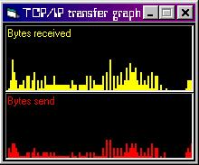



## TCP/IP data tranfer graph \(shows bytes send/received in a graph form\)

### Description

The program has two pictureboxes. One shows the bytes currently being received and the other the bytes being send.

I did not know whether the iphlpapi dll comes with windows so I included it in the zip file.
 
### More Info
 

             |
---                |---
**Submitted On**   |2000-11-17 19:52:16
**By**             |[Michael Frey](https://github.com/Planet-Source-Code/PSCIndex/blob/master/ByAuthor/michael-frey.md)
**Level**          |Intermediate
**User Rating**    |4.3 (34 globes from 8 users)
**Compatibility**  |VB 6\.0
**Category**       |[Internet/ HTML](https://github.com/Planet-Source-Code/PSCIndex/blob/master/ByCategory/internet-html__1-34.md)
**World**          |[Visual Basic](https://github.com/Planet-Source-Code/PSCIndex/blob/master/ByWorld/visual-basic.md)
**Archive File**   |[CODE\_UPLOAD1177811172000\.zip](https://github.com/Planet-Source-Code/michael-frey-tcp-ip-data-tranfer-graph-shows-bytes-send-received-in-a-graph-form__1-12874/archive/master.zip)

